<p align="center">
  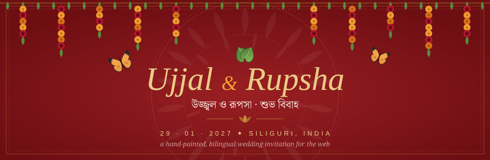
</p>

<p align="center">
  <b>শুভ বিবাহ</b> · a Bengali folk-art storybook that happens to be a wedding invitation
</p>

<p align="center">
  
  
  
  
  
  
  
</p>

> *Together with our families, we joyfully invite you to celebrate the beginning of our forever.
> Your presence would make our day complete.*

---

## 📜 পট — the invitation, frame by frame

Bengal's *patuas* unroll a painted scroll one frame at a time while they sing the story.
This site does the same: every section is a frame, every motif is drawn by hand in SVG, and nothing is a stock template.

<table>
  <tr>
    <td width="50%">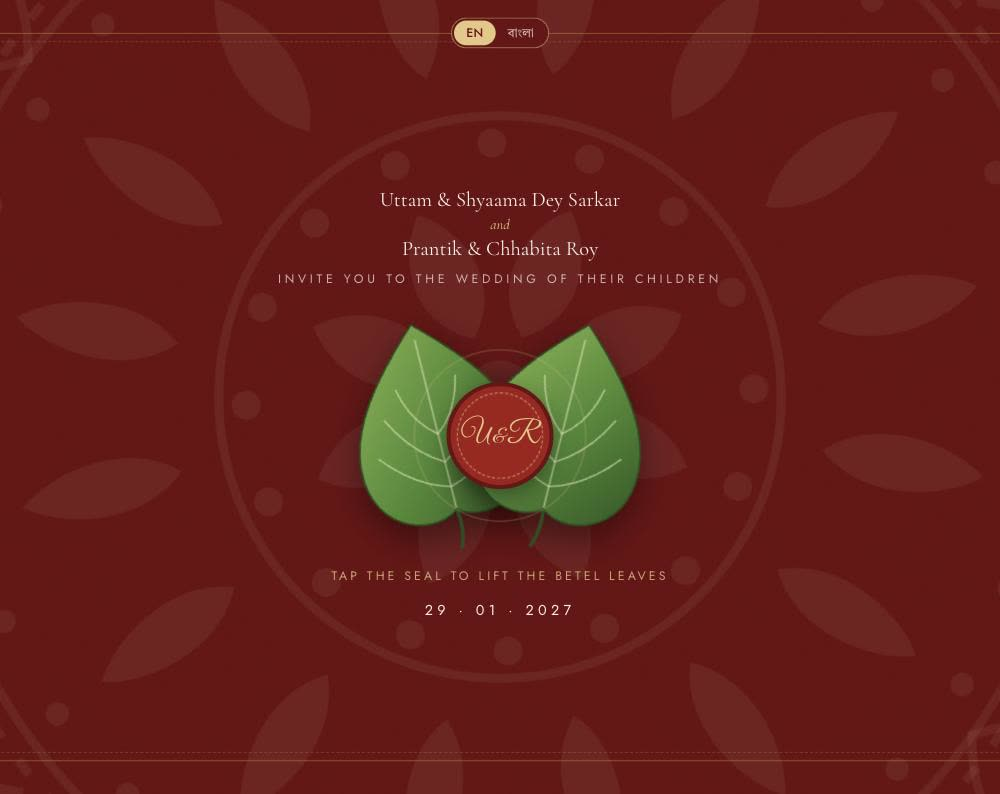</td>
    <td width="50%">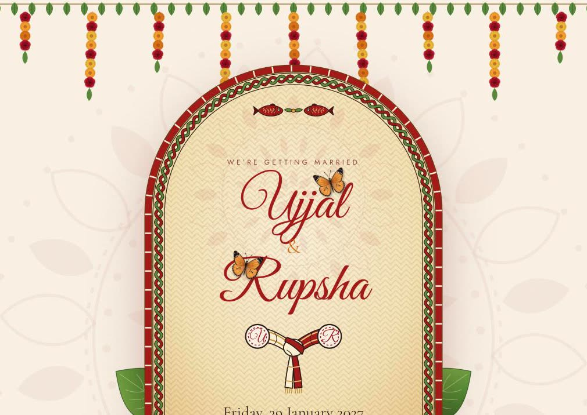</td>
  </tr>
  <tr>
    <td valign="top"><b>পট ১ · Shubho Drishti</b><br>The names hide behind two paan leaves, the way a bride hides her face. Tap the wax seal and the leaves part.</td>
    <td valign="top"><b>পট ২ · The biyer kulo</b><br>The names are painted on an upside-down bamboo <i>kulo</i> with a braided knot border, a <i>gatchhora</i> tying the couple's initials together and a pair of fish, under a toran of marigolds and red roses.</td>
  </tr>
  <tr>
    <td width="50%">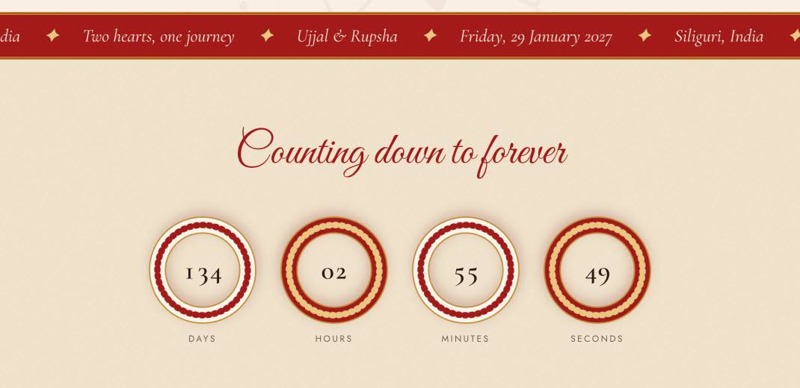</td>
    <td width="50%">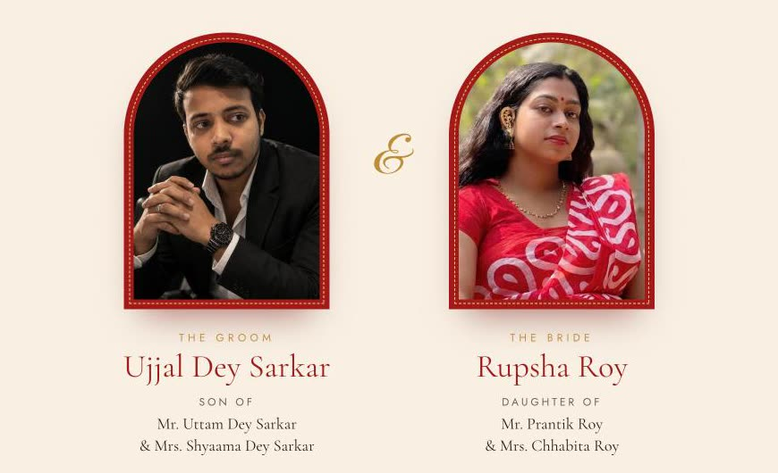</td>
  </tr>
  <tr>
    <td valign="top"><b>পট ৩ · Counting down to forever</b><br>Days, hours, minutes and seconds turn inside <i>shakha-pola</i>, the conch-white and coral-red bangles of a Bengali bride.</td>
    <td valign="top"><b>পট ৪ · The couple</b><br>Arch portraits with a blessing from each family. The groom always comes first.</td>
  </tr>
  <tr>
    <td width="50%">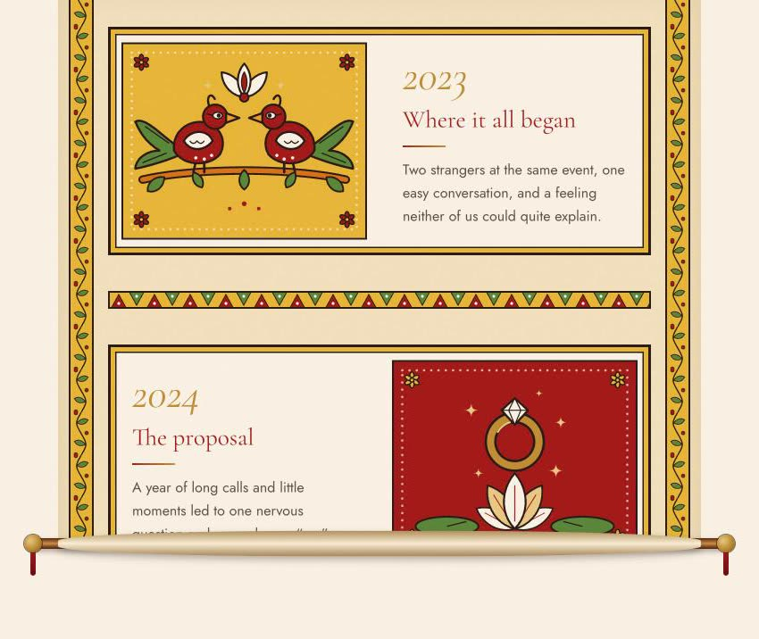</td>
    <td width="50%">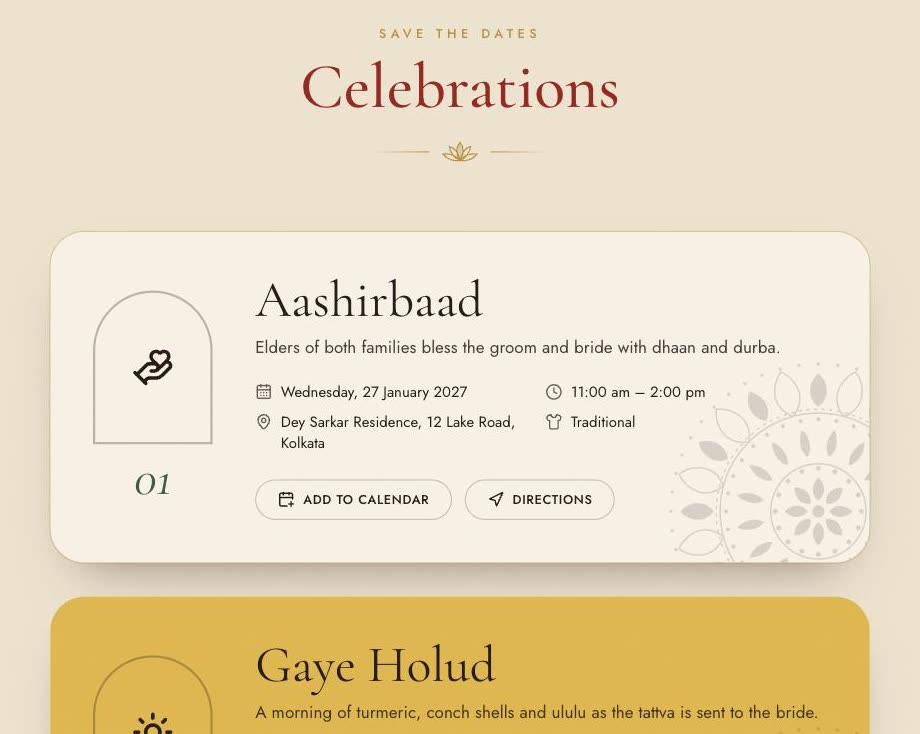</td>
  </tr>
  <tr>
    <td valign="top"><b>পট ৫ · Our Story</b><br>A <i>patachitra</i> scroll unrolls on its wooden rollers as you scroll. Each chapter has its own painting: two birds, a ring on a lotus, a <i>nouka</i>, two village homes, rings on a thala, and the topor and mukut.</td>
    <td valign="top"><b>পট ৬ · Celebrations</b><br>Ritual cards stack as you scroll, coloured dhaan, haldi, sindoor and kolapata, each with add-to-calendar and directions.</td>
  </tr>
  <tr>
    <td width="50%">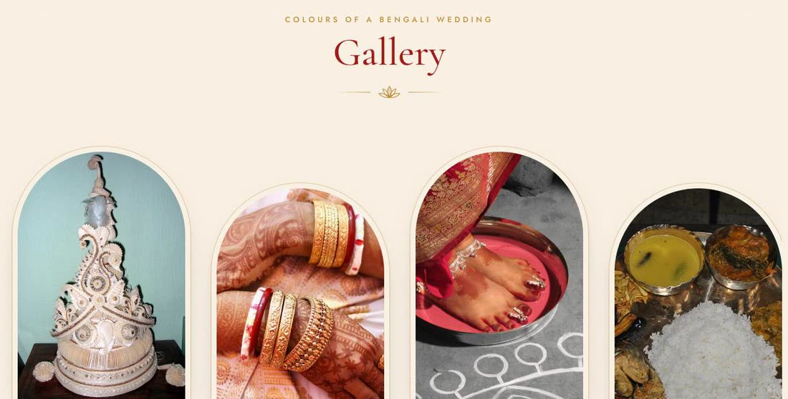</td>
    <td width="50%">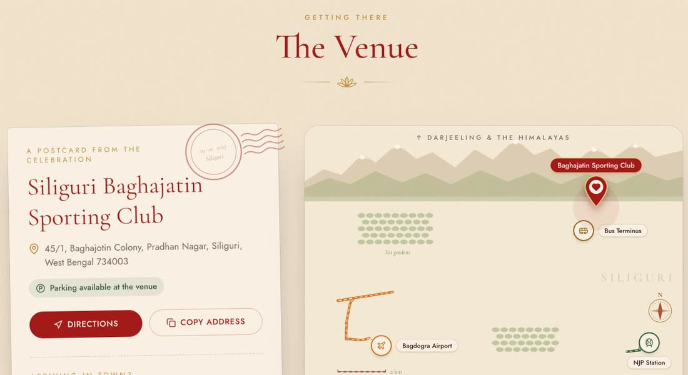</td>
  </tr>
  <tr>
    <td valign="top"><b>পট ৭ · Colours of a Bengali wedding</b><br>An arch-framed strip of shola topor, shankha-pola, alta, the <i>biye-bari</i> feast, Kanchenjunga at sunrise and Siliguri's tea gardens.</td>
    <td valign="top"><b>পট ৮ · Getting there</b><br>A vintage postcard beside a map drawn from real driving routes from Bagdogra Airport, NJP station and the bus terminus. Flip it and a live 3D satellite globe spins towards India and flies down to the venue.</td>
  </tr>
  <tr>
    <td colspan="2" align="center">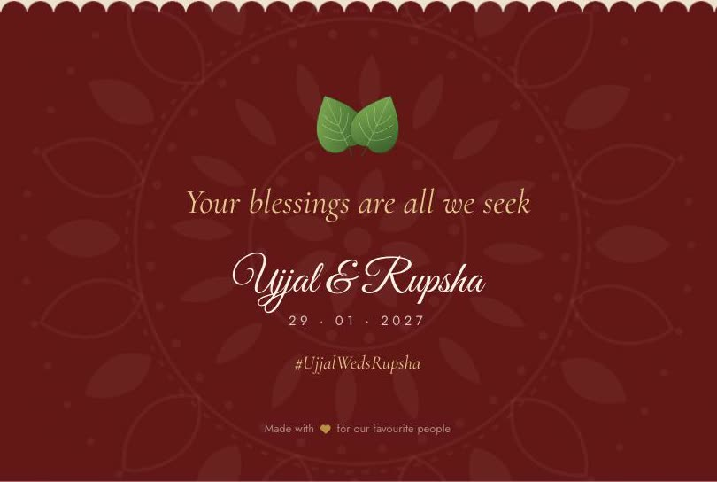<br><b>পট ৯ · Your blessings are all we seek</b><br>A scalloped edge, an alpona, and one last line.</td>
  </tr>
</table>

---

## ✨ Little things you might miss

<p align="center">
  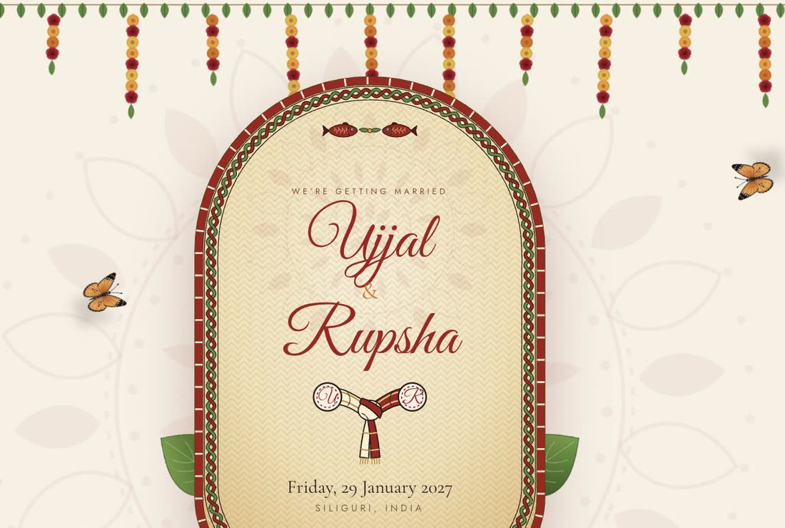
</p>

- 🦋 **Two Plain Tiger butterflies** (*Danaus chrysippus*, common all over Bengal) fly in along smooth curved paths with 3D wingbeats. Their shadows tighten as they land on the names, and at rest they slowly open and close their wings.
- 🌹 **The toran** is a garland of marigolds, and every third flower from the bottom is a red rose.
- 🪢 **Two knots:** an interlaced braid runs all the way round the kulo, and the *gatchhora* ties the groom's cream cloth to the bride's red one.
- 🧵 **No menu bar.** A wax seal in the corner fills its stitched ring as you scroll. Tap it and a garland of section beads unrolls on a kantha thread.
- 🎶 **An original shehnai** (Raag Yaman over a drone), synthesised from scratch by `scripts/make-shehnai.py`. It's switched off for now.
- 💌 **Personal links:** `?to=Rahul%20%26%20Family` greets a guest by name.
- ♿ **Reduced motion is respected:** with it switched on in the device settings, nothing flies, unrolls or sways.

## 🎨 The palette

<p>
  
  
  
  
  
  
  
</p>

Type is set in **Cormorant Garamond**, **Great Vibes** and **Jost**, with **Tiro Bangla** and **Galada** for Bengali.
A handmade-paper grain sits over the whole page.

## 🌐 Two languages, one invitation

<table>
  <tr>
    <td width="36%">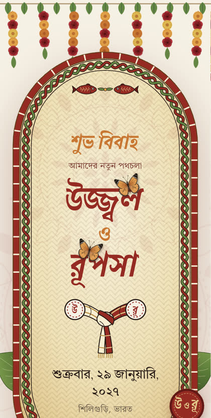</td>
    <td valign="top">

The toggle on the cover and in the garland menu switches the whole site between **English** and **বাংলা**.
Each version shows only its own language: the traditional lines (শ্রী শ্রী প্রজাপতয়ে নমঃ, শুভ বিবাহ…) appear only in Bengali, and the hashtag only in English.
Dates, times and numbers follow the language too (সন্ধ্যা ৬:০০).

The guest's choice is remembered, and a link can choose for them:

- `https://your-site.com/?lang=bn&to=রাহুল%20ও%20পরিবার` opens in Bengali and greets the guest by name
- `https://your-site.com/?lang=en&to=Rahul%20%26%20Family` opens in English

</td>
  </tr>
</table>

## 🚀 Run it locally

```bash
npm install
npm run dev       # http://localhost:5173
npm run build     # production build → dist/
npm run preview   # serve the build locally
npm run lint      # oxlint
npm run routes    # re-fetch the driving routes drawn on the venue map
```

## 🖌️ Make it yours

Nearly everything lives in **`src/config/wedding.ts`**. Text fields take both languages: `{ en: '…', bn: '…' }`.

| What | Where |
| --- | --- |
| Couple, parents, hosts, date, events, venue | `src/config/wedding.ts` |
| Story chapters and their paintings | `story` → `motif: 'birds' \| 'ring' \| 'boat' \| 'homes' \| 'rings' \| 'crowns'` (art in `src/components/art/PataArt.tsx`) |
| Where the butterflies land | `PERCHES` in `src/components/art/Butterflies.tsx` |
| Venue pin & travel hubs | `venue.coordinates` / `venue.journeys`, then run `npm run routes` |
| Event card colour | `theme: 'dhaan' \| 'haldi' \| 'sindoor' \| 'kolapata'` on each event |
| Interface text (buttons, labels) | `src/i18n/strings.ts` |
| Default language | `defaultLang` in `src/config/wedding.ts` |
| Colours & fonts | `@theme` block in `src/index.css` (fonts loaded in `index.html`) |
| Share preview (WhatsApp / social) | `<title>` and `og:*` tags in `index.html` |
| Photo inside the kulo | `public/images/hero.jpg` → `heroImage: '/images/hero.jpg'` |
| Couple photos | `public/images/couple/*` → `photo` on `groom` / `bride` (3:4 portrait, face in the upper half) |
| Gallery | `public/images/gallery/*` → `{ src, alt: { en, bn } }` (the current photos are Creative Commons, credited on the page and below) |
| Background music | Off by default. Uncomment `music: '/audio/shehnai.mp3'` for the bundled shehnai (re-render with `python3 scripts/make-shehnai.py`), or add your own `public/audio/song.mp3` → `music: '/audio/song.mp3'` |

## 🗺️ The live map

The back of the venue card is a [MapLibre GL](https://maplibre.org/) satellite globe with no API keys:

- **Imagery:** [EOxCloudless 2024](https://cloudless.eox.at) (Sentinel-2, 10 m/pixel), free for
  **non-commercial** use with visible attribution. Because of the 10 m resolution the flight lands at
  neighbourhood level (zoom ~14) rather than street level.
- **Roads & labels on top:** [OpenFreeMap](https://openfreemap.org/) vector tiles, restyled in
  `src/components/map/satelliteStyle.ts`.

MapLibre loads only when a guest flips the card, and falls back to a Google Maps embed on devices
without WebGL. The flight respects `prefers-reduced-motion`. Map labels stay in Latin script because
MapLibre can't shape Bengali yet.

## 🗂️ What's where

```
src/
├── config/          # wedding.ts (your content), types.ts, venue-routes.json (generated)
├── i18n/            # UI strings (en/bn), language context + provider
├── components/
│   ├── art/         # Kulo, Butterflies, PataArt, Toran, Alpona, PaanLeaf, LalPaar (hand-written SVG)
│   ├── map/         # IllustratedMap, GlobeMap (lazy), satellite style, route data
│   ├── layout/      # GarlandNav, Footer, MusicPlayer
│   └── ui/          # Section, Reveal, Ornament, Marquee, LanguageToggle, Bn
├── sections/        # Cover, Hero, Ribbon, Countdown, OurStory, Events, Gallery, Venue
├── hooks/           # useCountdown
├── lib/             # formatting, map projection, spline paths, calendar & maps links, utils
├── App.tsx          # page composition: reorder or remove sections here
└── index.css        # theme tokens, textures (lal-paar, kantha, pata, scallop, stamp)
scripts/
├── fetch-venue-routes.mjs   # OSRM routes → src/config/venue-routes.json
└── make-shehnai.py          # renders public/audio/shehnai.mp3
docs/                        # README banner and screenshots
.github/workflows/deploy.yml # CI: lint, build and deploy to Vercel
```

## ☁️ Deploy

Live at **[ujjal-weds-rupsha.vercel.app](https://ujjal-weds-rupsha.vercel.app)**, deployed automatically by GitHub Actions
(`.github/workflows/deploy.yml`):

| When | What happens |
| --- | --- |
| Push to `main` | Lint → build → **production** deploy |
| Pull request | Lint → build → **preview** deploy, with the link posted on the PR |
| Actions → Deploy → *Run workflow* | Production from `main`, preview from any other branch |

The workflow needs one repository secret, `VERCEL_TOKEN` (create it at
[vercel.com/account/settings/tokens](https://vercel.com/account/settings/tokens), scoped to the project's team).

It's a static site, so any static host works. To deploy by hand with the Vercel CLI:

```bash
npx vercel          # preview
npx vercel --prod   # production
```

## 🙏 Credits

- **Gallery photos** from Wikimedia Commons:
  [Shola topor](https://commons.wikimedia.org/wiki/File:Topor.jpg) by Sumit Paul-Choudhury (CC BY 2.0) ·
  [Shankha, pola & mehendi](https://commons.wikimedia.org/wiki/File:Bride_wearing_Shankha_Pola_at_a_Bengali_Wedding.jpg) by AnkitaaDeb (CC BY-SA 4.0) ·
  [Alta](https://commons.wikimedia.org/wiki/File:Feet-in-alta.jpg) by Shounak Ray (CC BY-SA 2.0) ·
  [Biye-bari feast](https://commons.wikimedia.org/wiki/File:Bengal_Wedding_Delight.JPG) by Pulak Pattanayak (CC BY-SA 4.0) ·
  [Kanchenjunga at sunrise](https://commons.wikimedia.org/wiki/File:Morning_sunlight_on_Kangchenjunga_summit_view_from_Darjeeling,_West_Bengal.jpg) by Yuvraj Anand (CC BY-SA 4.0) ·
  [Tea gardens of Siliguri](https://commons.wikimedia.org/wiki/File:TEA_GARDEN,SILIGURI,INDIA.jpg) by Chayandas0308 (CC BY-SA 4.0)
- **Maps:** imagery by [EOxCloudless 2024](https://cloudless.eox.at), vector tiles by [OpenFreeMap](https://openfreemap.org/),
  routes from [OSRM](https://project-osrm.org/), map data © [OpenStreetMap](https://www.openstreetmap.org/copyright) contributors
- **Fonts** from [Google Fonts](https://fonts.google.com/) · **icons** from [Lucide](https://lucide.dev/)
- **Inspiration:** Bengal's *patachitra* scroll painters, and the painted *kulo* of the boron dala

<p align="center">
  <br>
  <sub>Made with 💛 for our favourite people · <b>উজ্জ্বল ও রূপসা</b> · ২৯ জানুয়ারি ২০২৭</sub>
</p>
